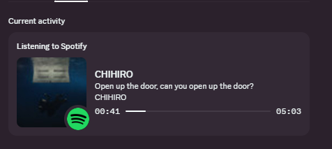

# Spotify Live Status

Show your Spotify status on Discord with **live lyrics support**.



## How it works

- A Tampermonkey userscript runs on `open.spotify.com` and reads the current track, album art, and lyrics from the page
- The desktop app receives that data over a local WebSocket and pushes it to Discord via Rich Presence

## Requirements

- [Discord](https://discord.com) desktop app (must be running)
- [Tampermonkey](https://www.tampermonkey.net) browser extension (one-time setup)

## Setup

### 1. Download and install the app

Grab the latest **Spotify Live Status Setup.exe** from the [Releases](../../releases/latest) page and run it.  
The app installs silently and appears in your system tray.

### 2. Install the userscript (one-time)

1. Install [Tampermonkey](https://www.tampermonkey.net) in Chrome, Edge, or Firefox if you haven't already
2. Open [browser.js](browser.js), click **Raw**, then copy all the text
3. In Tampermonkey, click **Create a new script**, paste it in, and hit **Save** (Ctrl+S)

That's it — the userscript will automatically run every time you open Spotify in your browser.

### 3. Use it

1. Make sure Discord is open
2. Launch **Spotify Live Status** from the Start menu (or it may already be running in the tray)
3. Open [open.spotify.com](https://open.spotify.com) and play a track
4. Open the **lyrics panel** and **expand the album art** for best results


Your Discord status updates automatically within a few seconds. The tray icon tooltip shows the current status.

## Tips

- Right-click the tray icon → **Quit** to exit
- The current lyric line updates live as the song plays
- If your status stops updating, refresh the Spotify browser tab
- Only one instance can run at a time (port 8080)

## Build from source

```bash
git clone https://github.com/areeb-saqib/spotify-live-status
cd spotify-live-status
npm install
npm run dev        # run in dev mode
npm run dist       # build installer → release/
```

Requires [Node.js](https://nodejs.org) v18+ and [Git](https://git-scm.com).
